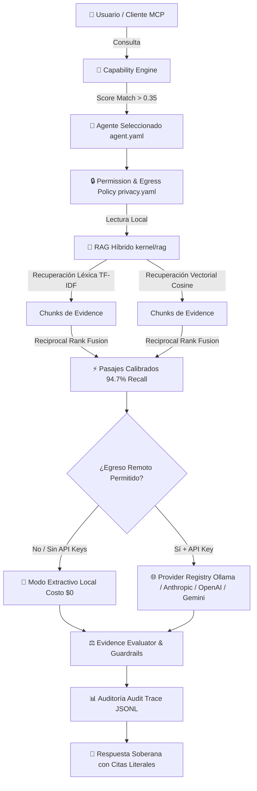
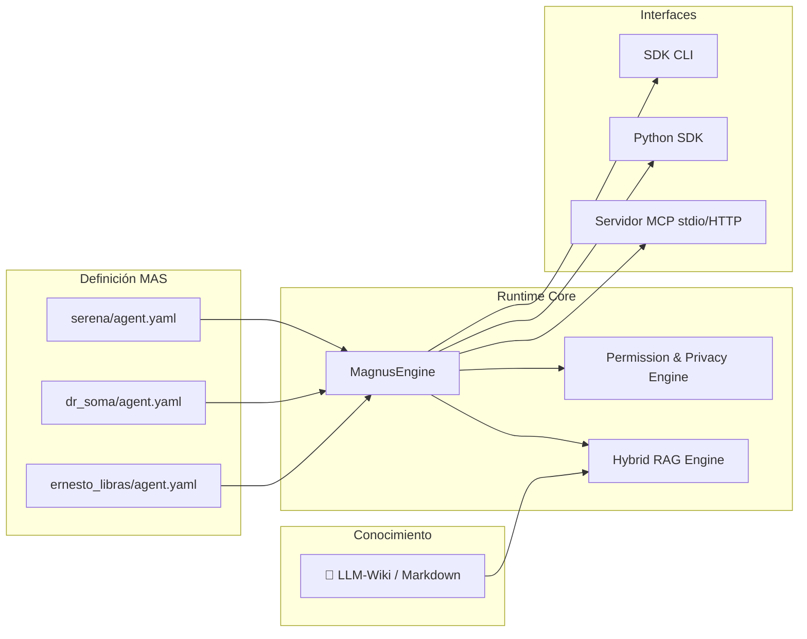

# 🚀 Magnus Agent Engine (MAS)

**Sistema operativo multiagente soberano, independiente del proveedor de IA y centrado en privacidad (Local-First).**

[](https://www.python.org/)
[](LICENSE)
[](https://modelcontextprotocol.io/)
[](#1-sistema-rag-híbrido)

> **Autoría & Desarrollo:** Creado y mantenido por **Yoxe / Magnus Dynamic Group** ([`YoxeLaunch/MagnusAgentSpecification`](https://github.com/YoxeLaunch/MagnusAgentSpecification)).

---

## ⏱️ Magnus en 10 Segundos

### 1. ¿Qué problema resuelve?
Las arquitecturas tradicionales de IA (LangChain, AutoGen, CrewAI) sufren del **dilema entre inteligencia y privacidad**: para responder preguntas complejas, fuerzan el envío de datos sensibles corporativos o personales (finanzas, salud, propiedad intelectual) a modelos de lenguaje en la nube, o alucinan al depender de conocimiento estático.

**Magnus resuelve esto separando el Razonamiento (modelos de IA) del Conocimiento (`LLM-Wiki/` local en Markdown versionado)** e imponiendo un control estricto de **Gobernanza de Egreso de Datos (`privacy.yaml`)** en tiempo de ejecución.

### 2. ¿En qué se diferencia de soluciones existentes?

| Característica | Frameworks Tradicionales (LangChain, CrewAI) | 🚀 **Magnus Agent Engine (MAS)** |
|---|---|---|
| **Soberanía y Privacidad** | Envía prompts completos y contexto a APIs externas | **Local-First:** Egreso bloqueado por políticas (`local_only` jamás sale a la nube) |
| **Operación Offline / Air-Gapped** | Requiere conexión a internet y API Keys activas | **Modo Extractivo:** Funciona 100% offline a **costo $0** sin LLM ni API Keys |
| **Recuperación RAG** | Vectorial simple / Búsqueda básica | **RAG Híbrido Calibrado (94.7% Recall):** TF-IDF + Random Indexing con RRF |
| **Enrutado de Agentes** | Clasificación por LLM (costosa y lenta) | **Capability Engine:** Clasificación determinista semántico-léxica a **costo 0** |
| **Estandarización** | Configuración ad-hoc por código | **Estándar MAS:** Agentes declarativos versionados en `agent.yaml` |
| **Integración con IDEs** | Conectores propietarios | **Servidor MCP Nativo (`stdio` / `HTTP`):** Conexión directa a Claude Code, Cursor y VS Code |

### 3. ¿Cómo se ve en código en 5 líneas?

```python
from sdk import MagnusEngine

engine = MagnusEngine(root=".")
resultado = engine.ask("¿Cómo organizo mi presupuesto y quiero invertir mi dinero?")

print(f"🤖 Agentes: {resultado['agentes']}")
print(f"💬 Respuesta: {resultado['respuesta']}")
```

---

## 📐 Diagramas de Arquitectura

### 1. Flujo de Datos y Pipeline de Privacidad/RAG



### 2. Estructura de Agentes y Arquitectura de Componentes



---

## ⚡ PoC & Inicio Rápido (SDK Minimal)

Puedes probar Magnus inmediatamente en tu entorno local sin registrar ninguna clave API:

```bash
# 1. Clonar el repositorio
git clone https://github.com/YoxeLaunch/MagnusAgentSpecification.git
cd MagnusAgentSpecification

# 2. Instalar en modo desarrollo
python -m pip install -e ".[dev]"

# 3. Ejecutar la PoC minimalista (<20 líneas de código)
python -m examples.quickstart
```

---

## ✨ Características Principales

| Característica | Descripción |
|---|---|
| 🤖 **Orquestación Multiagente (MAS)** | Arquitectura extensible basada en `agent.yaml`, con taxonomía de capacidades, reglas éticas, guardrails y contexto aislado. |
| 🧠 **RAG Híbrido Calibrado (94.7% Recall)** | Recuperación combinada **Léxica (TF-IDF)** + **Vectorial Local (Random Indexing / Coseno)** con Reciprocal Rank Fusion (RRF) sobre pasajes reales. |
| 🎯 **Enrutado de Capacidades (Capability Matching)** | Clasificación determinista de intención combinando solape léxico, sinónimos coloquiales curados y filtrado de taxonomía de ancestros. |
| 🔒 **Engine de Privacidad y Permisos Granulares** | Enforce en tiempo de ejecución de `privacy.yaml` (bloqueo de egreso remoto) y `permissions.yaml` (acceso a herramientas/namespaces por agente). |
| ⚡ **Servidor MCP Integrado** | Soporte completo del protocolo MCP tanto en transporte de bajo nivel `stdio` (sin puertos expuestos) como servidor HTTP seguro con tokens Bearer y CORS. |
| 📊 **Auditoría & Trazabilidad Completa** | Trazas estructuradas JSONL auditables con motivos de enrutado, puntuaciones RAG y estado de guardrails. |

---

## 🔌 Proveedores de IA Soportados

El puerto `LLMProvider` ([`providers/base.py`](providers/base.py)) abstrae la comunicación con los modelos de lenguaje. Se seleccionan de forma transparente según el perfil del agente en `configs/models.yaml`:

* **Modo Extractivo (Sin LLM / Sin Claves):** Si no hay API Key o proveedor activo, Magnus responde citando pasajes literales de la wiki sin costo ni llamadas externas.
* **Ollama ([`providers/ollama_provider.py`](providers/ollama_provider.py)):** Ejecución 100% local, privado, sin coste y sin conexión a internet.
* **Anthropic ([`providers/anthropic_provider.py`](providers/anthropic_provider.py)):** Modelos Claude (Claude 3.5 Sonnet, Claude 3 Opus, etc.).
* **OpenAI ([`providers/openai_provider.py`](providers/openai_provider.py)):** Modelos GPT-4o, GPT-4o-mini y embeddings compatibles.
* **Google Gemini ([`providers/google_provider.py`](providers/google_provider.py)):** Modelos Gemini 1.5 Pro y Gemini 1.5 Flash.

---

## 📐 Estructura del Repositorio

```
MAGNUS/
├── LLM-Wiki/wiki/   # Base documental versionada (fuente de verdad del conocimiento)
├── agents/          # Agentes definidos bajo el estándar MAS (ernesto_libras, dr_soma, etc.)
├── capabilities/    # Catálogo de capacidades y taxonomía de enrutado
├── constitution/    # Constitución ética, guardrails, evidencias y citación
├── orchestration/   # Motor de orquestación, router, permisos, memoria SQLite y auditoría
├── providers/       # Adaptadores de IA (Anthropic, OpenAI, Google, Ollama, Registry)
├── kernel/rag/      # Ingesta de archivos, retriever léxico, vectorial y pipeline híbrido
├── mcp_server/      # Servidor MCP (transportes stdio y HTTP) + controles de acceso
├── sdk/             # SDK de desarrollo y comandos CLI
├── examples/        # Ejemplos ejecutables (quickstart PoC)
├── evaluation/      # Benchmarks de recuperación RAG y enrutado de capacidades
├── configs/         # models.yaml, permissions.yaml, privacy.yaml, guardrails.yaml
├── tests/           # Suite de verificación completa (250+ tests en pytest)
└── docs/            # Especificación formal MAS y documentos de arquitectura
```

### Documentación de Diseño Formal

| Documento | Contenido |
|-----------|-----------|
| [`docs/00-VISION-Y-ARQUITECTURA.md`](docs/00-VISION-Y-ARQUITECTURA.md) | Tesis, principios, Clean Architecture, DDD, Hexagonal, flujo multiagente y escalabilidad. |
| [`docs/01-MAS-especificacion.md`](docs/01-MAS-especificacion.md) | Especificación del estándar MAS: estructura de un agente, `agent.yaml`, validación y herencia. |
| [`docs/02-COMPONENTES.md`](docs/02-COMPONENTES.md) | Los 15 componentes del sistema con sus interfaces, flujos y tecnologías. |
| [`docs/04-MAGNUS-V2-ARQUITECTURA.md`](docs/04-MAGNUS-V2-ARQUITECTURA.md) | **Normativo.** Reconciliación runtime↔docs: Agent Registry, Capability Engine, herencia y SDK. |

---

## 💻 Instalación, Verificación y Ejecución

### Requisitos Previos
* **Python 3.10** o superior.

### 1. Instalación del Entorno
```bash
# Clonar repositorio
git clone https://github.com/YoxeLaunch/MagnusAgentSpecification.git
cd MagnusAgentSpecification

# Instalación en modo desarrollo
python -m pip install -e ".[dev]"
```

### 2. Ejecutar la Suite de Pruebas
Magnus cuenta con una suite de verificación con más de 250 pruebas unitarias e integrales que se ejecutan localmente sin necesidad de claves API ni internet:

```bash
python -m pytest
```

### 3. Ejecutar Benchmarks de Evaluación
```bash
# Benchmarking de precisión RAG
python -m evaluation.bench_retrieval

# Benchmarking de enrutado de capacidades
python -m evaluation.bench_routing
```

---

## 🔌 Conectar Magnus vía MCP (Model Context Protocol)

Magnus actúa como un servidor de agentes que expone herramientas estándar MCP (`magnus_ask` y `magnus_list_agents`).

### Modo 1: Transporte `stdio` (Recomendado para Claude Code, Cursor, VS Code)
Sin exposición de sockets de red. Es lanzado directamente por la herramienta cliente:

```bash
python -m mcp_server.magnus_mcp
```

Ejemplo de configuración `.mcp.json` para clientes compatibles:
```json
{
  "mcpServers": {
    "magnus": {
      "command": "python",
      "args": ["-m", "mcp_server.magnus_mcp"],
      "cwd": "C:\\MagnusAgent"
    }
  }
}
```

### Modo 2: Transporte HTTP Local
Para clientes que interactúan vía peticiones HTTP / JSON-RPC:

```bash
python -m mcp_server.magnus_http --port 8765
```

Endpoints y Seguridad:
* URL: `POST http://127.0.0.1:8765/mcp`
* **Protección HTTP Guard:** Requiere token `MAGNUS_HTTP_TOKEN` si se habilita fuera de `127.0.0.1`, con Rate Limiting (60 req/min) y restricción estricta de CORS.

---

## 🔒 Privacidad y Gobernanza de Datos

Magnus implementa dos capas de seguridad que **deniegan por defecto**:

1. **Gobernanza de Egreso ([`configs/privacy.yaml`](configs/privacy.yaml)):**
   Define qué namespaces de conocimiento pueden salir del dispositivo. Namespaces como `local_only` (salud mental, finanzas personales) **nunca** son enviados a proveedores de IA en la nube (Anthropic, OpenAI, Google). Si se intenta consultar con un LLM remoto, el motor degrada automáticamente a respuesta extractiva local.
2. **Control de Acceso de Agentes ([`configs/permissions.yaml`](configs/permissions.yaml)):**
   Define el perímetro de lectura exacto de cada agente sobre la wiki y qué herramientas tiene autorizadas para usar.

---

## 📜 Licencia & Créditos

Desarrollado y mantenido por **Yoxe / Magnus Dynamic Group** ([`YoxeLaunch/MagnusAgentSpecification`](https://github.com/YoxeLaunch/MagnusAgentSpecification)) bajo licencia **Apache-2.0**.
