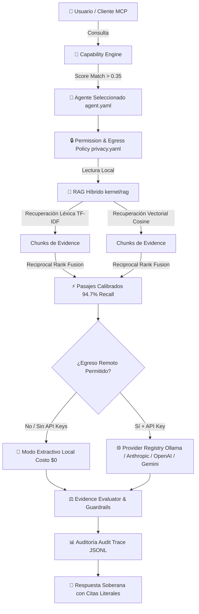

# Magnus Dynamic Group — Visión y Arquitectura

> Sistema operativo de agentes inteligentes, **independiente del proveedor de IA**.
> Documento maestro. Ver también: [`01-MAS-especificacion.md`](01-MAS-especificacion.md) y [`02-COMPONENTES.md`](02-COMPONENTES.md).

---

## 1. Tesis central

Un agente **no es** un contenedor de conocimiento. Un agente es una **política de razonamiento** que sabe *dónde buscar*, *cómo verificar* y *cómo comunicar*.

```
Agente clásico:   Conocimiento + Razonamiento + Personalidad   (acoplado, frágil)
Agente Magnus:    Razonamiento + Personalidad → consulta → Knowledge Kernel (RAG)
```

Consecuencia práctica: si mañana añades 5.000 documentos a `knowledge/economics/`, **Ernesto Libras mejora automáticamente** sin tocar una sola línea de su definición. El conocimiento y el agente evolucionan en ciclos independientes.

## 2. Principios rectores (no negociables)

| # | Principio | Implicación arquitectónica |
|---|-----------|----------------------------|
| P1 | Los agentes **no almacenan** conocimiento | El estado semántico vive fuera del agente (LLM Wiki + RAG). |
| P2 | Conocimiento como **base documental versionada** | `knowledge/` es la fuente de verdad; versionado tipo Git/DVC. |
| P3 | Acceso **solo por RAG** | Ningún agente hace fine-tuning ni memoriza hechos en pesos. |
| P4 | Especificación común **MAS** | Crear un agente = copiar una carpeta y editar Markdown/YAML. |
| P5 | Modelo **intercambiable** | Puertos y adaptadores: OpenAI, Anthropic, Google, Mistral, Ollama, OpenRouter. |
| P6 | Modular, escalable y **desacoplada** | Clean Architecture + DDD + eventos. |
| P7 | El humano **aprueba** los cambios de conocimiento | Aprendizaje supervisado con *human-in-the-loop*. |

## 3. Estilo arquitectónico

Magnus combina cuatro disciplinas:

- **Clean Architecture** — dependencias apuntan hacia el dominio; la infraestructura (proveedores, vector stores, colas) es reemplazable.
- **Domain-Driven Design** — lenguaje ubicuo (Agent, Knowledge, Memory, Task, Evidence) y *bounded contexts* claros.
- **Event-Driven Architecture** — los componentes se comunican por eventos de dominio (`TaskPlanned`, `AnswerEvaluated`, `KnowledgeChangeProposed`).
- **Hexagonal (Ports & Adapters)** — cada capacidad externa (LLM, embeddings, storage, herramientas) es un *puerto* con múltiples *adaptadores*.

### Capas

```
┌───────────────────────────────────────────────────────────────┐
│  INTERFACES        API REST · CLI · Dashboard · Webhooks      │
├───────────────────────────────────────────────────────────────┤
│  APPLICATION       Casos de uso / Orquestación                  │
│                    Router · Planner · Delegation · Evaluator    │
├───────────────────────────────────────────────────────────────┤
│  DOMAIN            Agent · Knowledge · Memory · Task · Evidence │
│  (puro, sin I/O)   Policies · Constitution · MAS                │
├───────────────────────────────────────────────────────────────┤
│  INFRASTRUCTURE    Providers · VectorStore · EventBus · DB      │
│  (adaptadores)     Tools(MCP) · Audit · Auth · Cache            │
└───────────────────────────────────────────────────────────────┘
```

### Flujo de Datos y Pipeline de Ejecución



**Regla de oro:** el dominio no importa nada de infraestructura. `Agent` no sabe si el LLM es Anthropic u Ollama; solo conoce el puerto `LLMProvider`.

## 4. Bounded contexts (DDD)

| Contexto | Responsabilidad | Componentes principales |
|----------|-----------------|-------------------------|
| **Knowledge** | Ingesta, versionado y recuperación del saber | Knowledge Kernel, RAG, Versionado |
| **Cognition** | Decidir y ejecutar razonamiento | Router, Planner, Delegation, Context Builder |
| **Memory** | Recordar interacciones y hechos aprendidos | Motor de Memoria (corto/largo/episódica/semántica) |
| **Agents** | Identidad y capacidades de cada agente | Registro de agentes, MAS |
| **Model** | Abstracción de proveedores de IA | Adaptadores de proveedores |
| **Tooling** | Capacidades externas (MCP) | Sistema de herramientas |
| **Quality** | Calidad, evidencia, trazabilidad | Evaluador, Auditoría, Aprendizaje supervisado |
| **Governance** | Seguridad, permisos, constitución | Permisos, Constitution, Evidence/Citation policy |

## 5. Mapa de componentes (15)

```
                         ┌──────────────────────────┐
        Usuario ───────► │      API REST / CLI      │
                         └────────────┬─────────────┘
                                      │
                         ┌────────────▼─────────────┐
                         │    ROUTER INTELIGENTE    │  (1) intención → agentes
                         └────────────┬─────────────┘
                    ┌─────────────────┼─────────────────┐
                    ▼                 ▼                 ▼
              PLANIFICADOR       REGISTRO DE        MOTOR DE
              DE TAREAS          AGENTES (MAS)      MEMORIA
                    │                 │                 │
                    └──────► CONTEXT BUILDER ◄──────────┘
                                      │
              ┌───────────────────────┼───────────────────────┐
              ▼                       ▼                       ▼
        SISTEMA RAG            ADAPTADORES DE           SISTEMA DE
        + KNOWLEDGE KERNEL     PROVEEDORES DE IA        HERRAMIENTAS (MCP)
              │                       │                       │
              └───────────────────────┼───────────────────────┘
                                      ▼
                              EVALUADOR DE RESPUESTAS
                                      │
                    ┌─────────────────┼─────────────────┐
                    ▼                 ▼                 ▼
              AUDITORÍA Y        PERMISOS Y       APRENDIZAJE
              TRAZABILIDAD       SEGURIDAD        SUPERVISADO
                                                        │
                                                 VERSIONADO DEL
                                                 CONOCIMIENTO
```

1. Knowledge Kernel · 2. Sistema RAG · 3. Router Inteligente · 4. Planificador de tareas ·
5. Motor de Memoria · 6. Registro de agentes · 7. Adaptadores de proveedores · 8. Sistema de herramientas (MCP) ·
9. Evaluador de respuestas · 10. Auditoría y trazabilidad · 11. Permisos y seguridad · 12. API REST y CLI ·
13. Dashboard · 14. Versionado del conocimiento · 15. Aprendizaje supervisado.

## 6. Flujo de una consulta multiagente

Ejemplo: *"Quiero cambiar de trabajo porque estoy estresado y además quiero invertir mi dinero."*

```
1. Router detecta 3 intenciones:  economía · salud mental · productividad
2. Planner descompone en sub-tareas y define dependencias
3. Delegation asigna:  Ernesto (economía) · Serena (salud) · Amanda (productividad)
4. Cada agente:
     Context Builder → (Memoria + RAG sobre knowledge/) → Provider LLM → borrador
5. Evaluador valida cada borrador (evidencia, citas, confianza)
6. Router fusiona las respuestas → informe único y coherente
7. Auditoría registra todo el trace; Permisos filtró accesos; nada se ejecuta sin política
```

Esto es un **sistema multiagente colaborativo**, no un asistente monolítico.

## 7. Estructura de carpetas (raíz)

```
MAGNUS/
├── knowledge/          # Base documental (LLM Wiki) — fuente de verdad, versionada
├── agents/             # Un directorio por agente, conforme a MAS
├── constitution/       # Constitución, ética, política de evidencia y citación
├── orchestration/      # Router, Planner, Delegation, Evaluator, Memory, Context
├── providers/          # Adaptadores de proveedores de IA (puerto LLMProvider)
├── tools/              # Herramientas MCP (kiwix, terminal, browser, APIs…)
├── memory/             # Backends de memoria (short/long/episodic/semantic)
├── kernel/             # Knowledge Kernel + RAG + ingestión + versionado
├── domain/             # Entidades y políticas puras (DDD)
├── platform/           # EventBus, Audit, Auth, Cache, Observabilidad
├── api/                # API REST + Dashboard backend
├── cli/                # Interfaz de línea de comandos
├── configs/            # models.yaml, agents.yaml, permissions.yaml
└── tests/
```

## 8. Decisiones tecnológicas de referencia

| Necesidad | Opción recomendada | Alternativas |
|-----------|--------------------|--------------|
| Lenguaje núcleo | Python 3.12 (tipado con Pydantic v2) | Go para servicios de alto throughput |
| API | FastAPI + Uvicorn | Litestar |
| Vector store | Qdrant (autohospedable) | pgvector, Weaviate, Milvus |
| Embeddings | Puerto `Embedder` (bge-m3 local / voyage / openai) | Intercambiable como los LLM |
| Cola / eventos | Redis Streams → NATS/Kafka a escala | RabbitMQ |
| Base de datos | PostgreSQL (metadatos, auditoría, memoria larga) | — |
| Cache | Redis | — |
| Herramientas | **MCP** (Model Context Protocol) | Función-calling nativo por proveedor |
| Versionado conocimiento | Git + DVC/LakeFS para binarios grandes | — |
| Observabilidad | OpenTelemetry + Prometheus + Grafana | — |
| Contenedores | Docker + Kubernetes (a escala) | Nomad |

## 9. Estrategia de escalabilidad global

- **Stateless donde se pueda.** Router, Planner y adaptadores no guardan estado → escalado horizontal trivial.
- **Estado en backends dedicados.** Memoria y conocimiento en Postgres/Qdrant con réplicas de lectura.
- **Colas para picos.** Las tareas largas de agentes van por cola; el usuario recibe respuesta por streaming o webhook.
- **Cientos de agentes.** El Registro carga definiciones bajo demanda; el Router usa un índice semántico de agentes (embedding de `identity.md` + `skills.md`) para enrutar en O(log n), no O(n).
- **Multi-tenant.** Cada workspace aísla `knowledge/`, permisos y auditoría.

---

Continúa en [`01-MAS-especificacion.md`](01-MAS-especificacion.md) y el detalle de los 15 componentes en [`02-COMPONENTES.md`](02-COMPONENTES.md).
